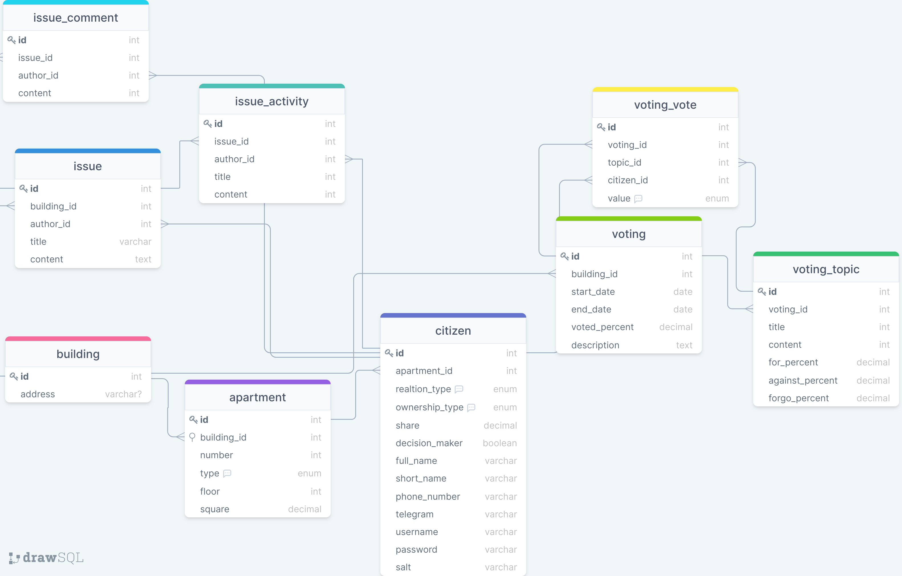

# Databases Design

[Interactive model](https://drawsql.app/community-services/diagrams/community-of-building-owners/)

This is a database of apartment owners in a building. It contains data about owners, apartments, building. 
Also, it has additional data about activities about some common issues of building owners.
Another part of database is about common voting about common issues. 
This is a legal procedure in Russia to make some decisions and perform some changes for example building management replacement.

Database can solve the next business goals:
1. Hold owners data.