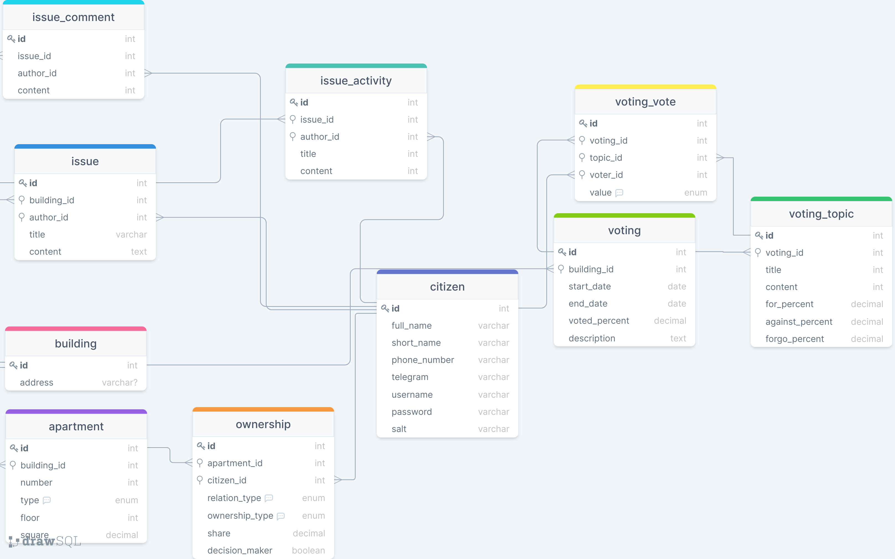

# Добавление индексов и ограничений

[Английская версия](.)

[Интерактивная модель](https://drawsql.app/community-services/diagrams/community-of-building-owners/)

Таблицы:

**building**

| name    | type   | index type | constraint       | comments                   |
|---------|--------|------------|------------------|----------------------------|
| id      | bigint | index      | unique, not null | primary key, autoincrement |
| address | text   |            | not null         |                            |

---
**apartment**

| name        | type    | index type | constraint            | comments                      |
|-------------|---------|------------|-----------------------|-------------------------------|
| id          | bigint  | index      | unique, not null      | primary key, autoincrement    |
| building_id | bigint  | index      | not null, foreign key | building(id)                  |
| number      | int     |            | not null              |                               |
| type        | enum    |            | not null              | (living, commercial, parking) |
| floor       | int     |            | not null              |                               |
| square      | decimal |            | not null              |                               |

---
**citizen**

| name           | type    | index type | constraint            | comments                   |
|----------------|---------|------------|-----------------------|----------------------------|
| id             | bigint  | index      | unique                | primary key, autoincrement |
| full_name      | text    |            | not null              |                            |
| short_name     | text    |            | not null              |                            |
| phone_number   | text    |            |                       |                            |
| telegram       | text    |            |                       |                            |
| username       | text    |            | unique                |                            |
| password       | text    |            |                       |                            |
| salt           | text    |            |                       |                            |

---
**ownership**

| name           | type    | index type | constraint            | comments                   |
|----------------|---------|------------|-----------------------|----------------------------|
| id             | bigint  | index      | unique                | primary key, autoincrement |
| apartment_id   | bigint  | index      | not null, foreign key | apartment(id)              |
| citizen_id     | bigint  | index      | not null, foreign key | citizen(id)                |
| relation_type  | enum    |            | not null              | (owner, renter)            |
| ownership_type | enum    |            |                       | (single, joint, share)     |
| share          | decimal |            |                       |                            |
| decision_maker | boolean |            | not null              |                            |

---
**issue**

| name        | type   | index type | constraint            | comments                   |
|-------------|--------|------------|-----------------------|----------------------------|
| id          | bigint | index      | unique                | primary key, autoincrement |
| building_id | bigint | index      | not null, foreign key | building(id)               |
| author_id   | bigint | index      | not null, foreign key | citizen(id)                |
| title       | text   |            | not null              |                            |
| content     | text   |            | not null              |                            |

---
**issue_comment**

| name      | type   | index type | constraint            | comments                   |
|-----------|--------|------------|-----------------------|----------------------------|
| id        | bigint | index      | unique                | primary key, autoincrement |
| issue_id  | bigint | index      | not null, foreign key | issue(id)                  |
| author_id | bigint | index      | not null, foreign key | citizen(id)                |
| content   | text   |            | not null              |                            |

---
**issue_activity**

| name      | type   | index type | constraint            | comments                   |
|-----------|--------|------------|-----------------------|----------------------------|
| id        | bigint | index      | unique                | primary key, autoincrement |
| issue_id  | bigint | index      | not null, foreign key | issue(id)                  |
| author_id | bigint | index      | not null, foreign key | citizen(id)                |
| title     | text   |            | not null              |                            |
| content   | text   |            |                       |                            |

---
**voting**

| name          | type    | index type | constraint            | comments                   |
|---------------|---------|------------|-----------------------|----------------------------|
| id            | bigint  | index      | unique                | primary key, autoincrement |
| building_id   | bigint  | index      | not null, foreign key | building(id)               |
| start_date    | date    |            | not null              |                            |
| end_date      | date    |            | not null              |                            |
| voted_percent | decimal |            | not null              |                            |
| description   | text    |            | not null              |                            |

---
**voting_topic**

| name            | type    | index type | constraint            | comments                   |
|-----------------|---------|------------|-----------------------|----------------------------|
| id              | bigint  | index      | unique                | primary key, autoincrement |
| voting_id       | bigint  | index      | not null, foreign key | voting(id)                 |
| title           | text    |            | not null              |                            |
| content         | text    |            | not null              |                            |
| for_percent     | decimal |            | not null              |                            |
| against_percent | decimal |            | not null              |                            |
| forgo_percent   | decimal |            | not null              |                            |

---
**voting_vote**

| name      | type   | index type | constraint            | comments                   |
|-----------|--------|------------|-----------------------|----------------------------|
| id        | bigint | index      | unique                | primary key, autoincrement |
| voting_id | bigint | index      | not null, foreign key | voting(id)                 |
| topic_id  | bigint | index      | not null, foreign key | voting_topic(id)           |
| voter_id  | bigint | index      | not null, foreign key | citizen(id)                |
| vote      | enum   |            | not null              | (for, against, forgo)      |

