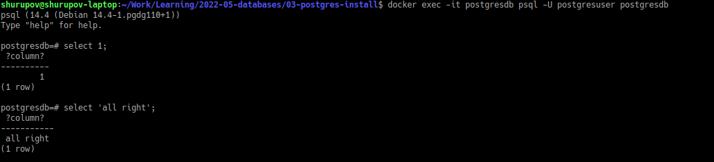
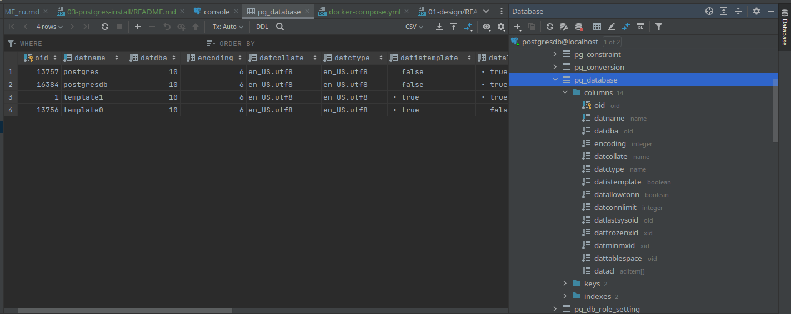
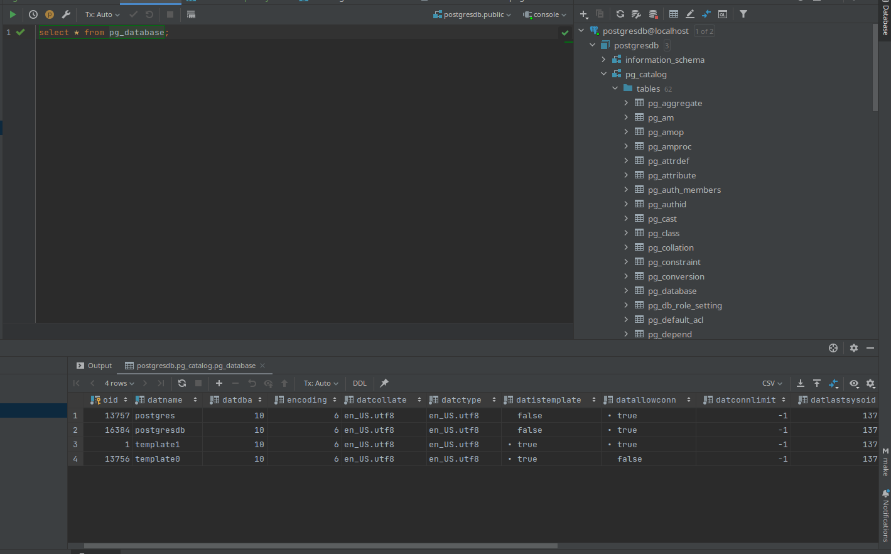

# Installing and starting postgres database

[Russian version](README_ru.md)

1. Install and start postgres server
    
    `docker-compose up`

    First time is installs and starts

    
    

2. Start postgres server

   `docker-compose up`

   Next time it just starts

   

3. Start terminal client psql in docker

    `docker exec -it postgresdb psql -U postgresuser postgresdb`

   

4. Connecting to postgres via Intellij Idea db tool

   
   
   
