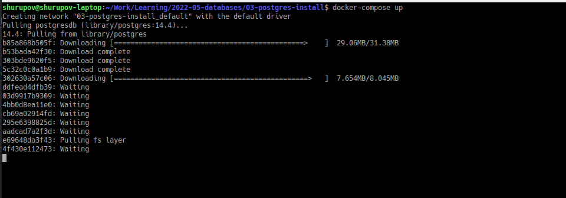
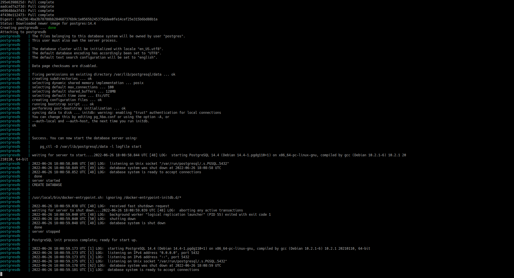
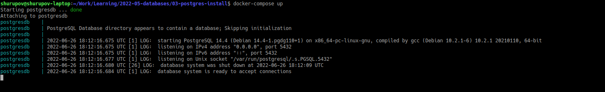
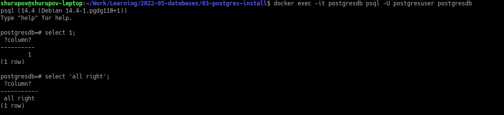
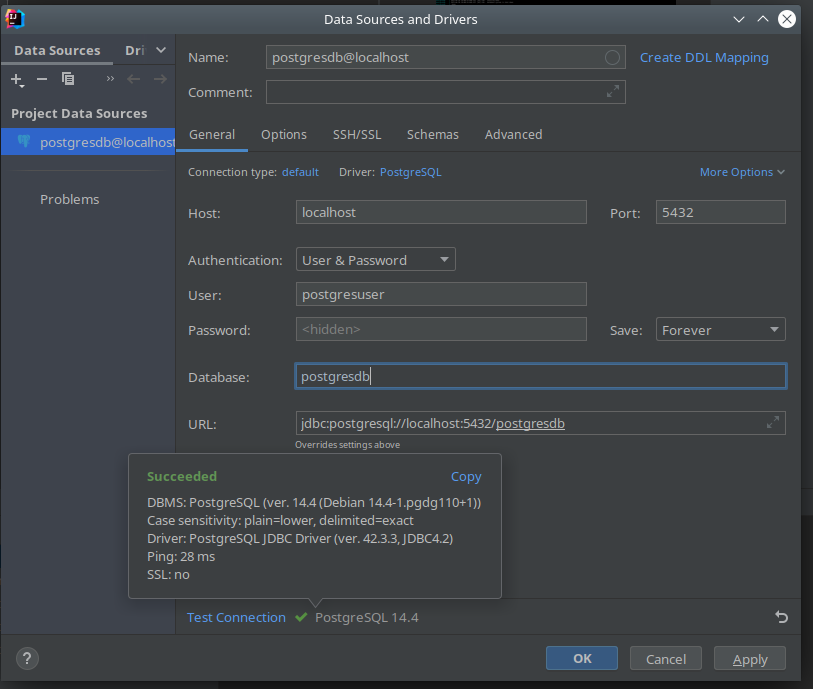
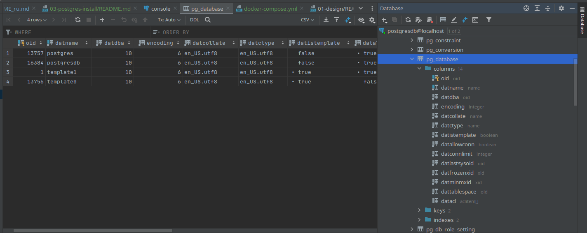
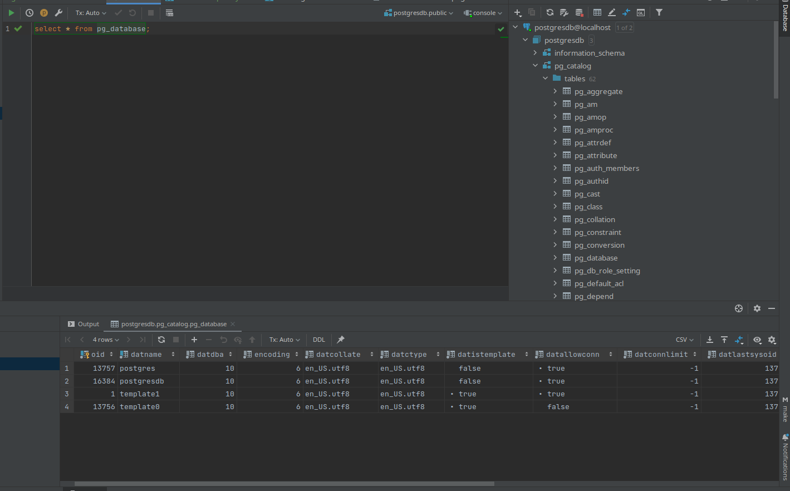

# Установка и запуск БД postgres

[Russian version](README_ru.md)

1.  Установка и запуск postgres-сервера

   `docker-compose up`

   В первый раз конманда устанавливает и запускает

   
   

2. Стерт postgres-сервера

   `docker-compose up`

   Следующие разы эта команда только стартует сервер

   

3. Запуск клиента psql из командной строки из докера

   `docker exec -it postgresdb psql -U postgresuser postgresdb`

   

4. Подключение к postgres с помощью средств Intellij Idea

   
   
   
