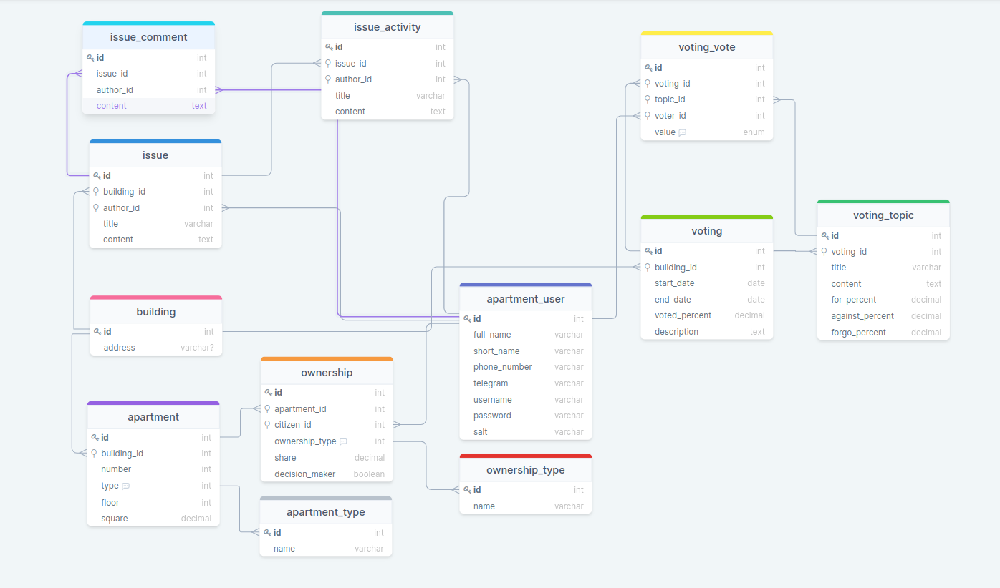

# DML: insert, update, delete, select

[Russian version](README_ru.md)



[Interactive model](https://drawsql.app/community-services/diagrams/community-of-building-owners/)

To check queries below you can execute [initialization data script](initialize.sql)

## 1. Select with regexp
```postgresql
select count(*) from homeowners.apartment_user where full_name ~ '([Сс]ер([её][жг]а|гей))';
```
The query searches an amount of users having name `Сергей` (Sergey).

## 2. Selecting with `left join`, `inner join`
```postgresql
select au.id, au.full_name, ot.name, o.share, at.name, a.number, a.floor, a.square
from homeowners.apartment_user au
inner join homeowners.ownership o on au.id = o.user_id
left join homeowners.ownership_type ot on o.ownership_type_id = ot.id
left join homeowners.apartment a on o.apartment_id = a.id
left join homeowners.apartment_type at on a.apartment_type_id = at.id;
```
The query lists all users with apartments they have and some additional information (ownership type, share, apartment type, number, floor, square).

## 3. Inserting data with returning added records
```postgresql
insert into homeowners.apartment_user (full_name, short_name, phone_number, telegram, username, password, salt) values 
('Сидоров Сидор Сидорович', 'Сидор', '+79998887766', '@sometelegram', 'sidor', 'fjdksjflksd', 'fdsf')   
returning full_name, short_name, phone_number, telegram, username, password, salt;
```
The query adds a user and returns added user record fields.

## 4. Updating data using `update from`
```postgresql
update voting.voting_topic vtt
set
    for_percent = calculated.for * 100 / calculated.voted,
    against_percent = calculated.against * 100 / calculated.voted,
    forgo_percent = calculated.forgo * 100 / calculated.voted
from (
    select
        vt.title,
        vt.id topic_id,
        sum(o.share * a.square) as voted,
        sum(
            case
                when (vv.value = 'for') then o.share * a.square
                else 0
            end
        ) as for,
        sum(
            case
                when (vv.value = 'against') then o.share * a.square
                else 0
            end
        ) as against,
        sum(
            case
                when (vv.value = 'forgo') then o.share * a.square
                else 0
            end
        ) as forgo
    from voting.voting_topic vt
    inner join voting.voting_vote vv on vv.topic_id = vt.id
    inner join homeowners.apartment_user au on vv.voter_id = au.id
    inner join homeowners.ownership o on au.id = o.user_id
    inner join homeowners.apartment a on o.apartment_id = a.id
    where vt.voting_id = 1 and ownership_type_id in (1,2,3)
    group by vt.id
    order by vt.id
) as calculated
where vtt.id = calculated.topic_id;
```
The query calculates and saved voting results for every topic ov voting with id=1

## 4. Removing data using `delete`, `using` and `join`
```postgresql
delete from ownership where ownership_type_id not in (1,2,3);

delete from apartment_user auu
using (
    select au.* from apartment_user au
    left join ownership o on au.id = o.user_id
    where o.id is null
) not_owner
where auu.id = not_owner.id;
```
The query removes all users who are not owners of any apartment.