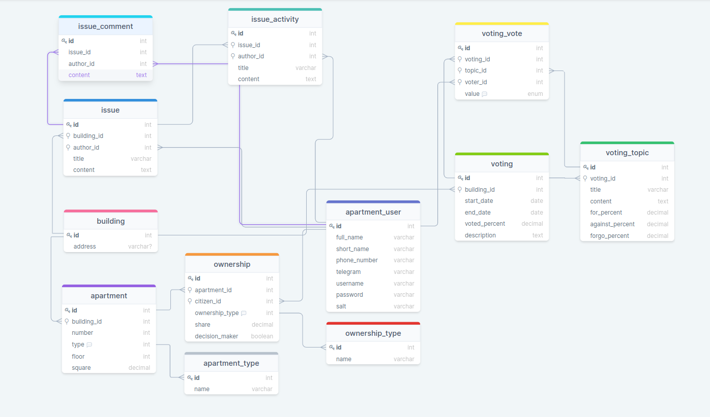

# MySQL Data Types

[Russian version](README_ru.md)

[Interactive model](https://drawsql.app/community-services/diagrams/community-of-building-owners/)

[Init script](init.sql)

Since the last homework the following is changed:
1. `value` column type of `voting_vote` table is changed to `enum` 
2. `tags` column with `json` type is added to `voting` and `issue` tables

## Commands to manipulate and connect

To start database

`docker-compose up homeownersdb22`

To connect

`docker exec -it homeownersdb22 mysql -u root -p12345 homeowners`

To connect outside of container

`mysql -u root -p12345 --port=3309 --protocol=tcp homeowners`